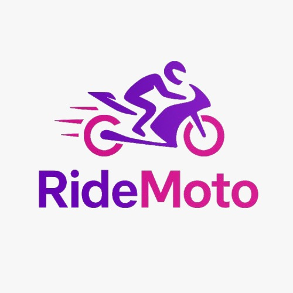

<a id="readme-top"></a>
<!--
***Obrigado por visitar o repositório do RideMoto! 💜
  ***Este projeto foi desenvolvido com o objetivo de criar um sistema web robusto e eficiente, utilizando Java (Spring Boot) no backend e JS, CSS e HTML no frontend. Através de uma arquitetura bem definida, com integração com bancos de dados, buscamos oferecer uma solução escalável e confiável para a gestão de dados.
  ***Se você tiver sugestões, dúvidas ou quiser contribuir com melhorias, sinta-se à vontade para abrir uma issue ou enviar um pull request.
  ***Obrigado novamente! Agora é hora de explorar a RideMoto e aproveitar um sistema completo e eficiente! 🚀
-->

<!--LOGO -->

<br />
<div align="center">
    
  </a>


  <p align="center">
    <br />
  </p>
</div>


<!-- Indice tabelas -->
<details>
  <summary> Sumario</summary>
  <ol>
    <li>
      <a href="#sobre-o-projeto">Sobre o projeto</a>
    </li>
    <li>
      <a href="#-workflow-de-desenvolvimento">Workflow de Desenvolvimento</a>
    </li>
    <li>
      <a href="#-manual-do-usuário">Manual do Usuário</a>
    </li>
    <li>
      <a href="#integrantes">Integrantes</a>
    </li>
    <li>
      <a href="#licença">Licença</a>
    </li>
    <li>
      <a href="#contatos">Contatos</a>
    </li>
  </ol>
</details>


<!-- Sobre o projeto -->

## Sobre o projeto

O Sistema de Aluguel de Motos é uma plataforma desenvolvida para facilitar a locação de motocicletas de forma rápida e eficiente. A aplicação centraliza informações sobre motos disponíveis, planos de aluguel e reservas em um único lugar. O sistema resolve problemas comuns de gestão de locadoras, como controle manual de reservas, falta de organização em planos e dificuldades na visualização do histórico de clientes.

Com funcionalidades como cadastro de usuários, exibição detalhada de motos, gestão de planos e acompanhamento de reservas, a plataforma atende tanto clientes quanto administradores, oferecendo uma experiência prática e segura para quem busca mobilidade de forma flexível.

### 🛠 Tecnologias Utilizadas 

-ED8B00?style=for-the-badge&logo=openjdk&logoColor=white)


<p align="right">(<a href="#readme-top">Voltar ao topo</a>)</p>


## 🔄 Workflow de Trabalho (Git, GitHub, Merge de Branches)

Durante o desenvolvimento do projeto, utilizamos o **Git** como sistema de versionamento e o **GitHub** como plataforma de colaboração em equipe. A equipe era composta por 3 integrantes, distribuídos entre as áreas de front-end, back-end e documentação.

#### 🛠️ Uso do Git para Versionamento

Cada integrante manteve o controle das suas alterações localmente com o Git, utilizando commits frequentes e descritivos para facilitar o rastreamento do histórico do projeto. O versionamento seguiu uma lógica de separação clara por área de atuação, evitando conflitos e promovendo um fluxo de trabalho organizado.

#### 🌿 Criação e Fusão de Branches

Adotamos um modelo baseado em múltiplas branches especializadas, com a seguinte estrutura:

- `main`: branch principal, que recebeu apenas a versão final e consolidada do projeto.
- `dev`: utilizada para integrar o front-end com o back-end e realizar os testes de integração.
- `front`: responsável pelo desenvolvimento do front-end.
- `back`: responsável pelo desenvolvimento do back-end.
- `doc`: utilizada para elaborar a documentação.

Cada integrante fazia *push* diretamente na branch correspondente à sua área (ex: `front`, `back`, `doc`). Após o desenvolvimento inicial, a branch `dev` foi utilizada como ponto de integração entre o front-end e o back-end. Quando todas as partes estavam finalizadas e testadas, um único *merge* foi feito da `dev` para a `main`, concluindo o projeto.

<p align="right">(<a href="#readme-top">Voltar ao topo</a>)</p>

---

### 🔧 Back-end

- Desenvolvimento da API REST com Java.
- Implementação do cadastro e autenticação de usuários.
- Integração com banco de dados MySQL.

---

### 🎨 Front-end

- Construção das telas de login, cadastro e navegação principal utilizando JS, CSS, HTML.
- Desenvolvimento das telas de visualização e edição das motos.
- Integração da interface com os serviços da API back-end.

---

### 🌿 Estrutura de Branches

O projeto é versionado por meio de uma organização clara de branches:

- `backend` – Contém toda a lógica e estrutura do back-end.
- `frontend` – Responsável pelo desenvolvimento da interface e interações do front-end.
- `dev` – Ambiente de integração onde o front-end, back-end e documentação são unificados.
- `main` – Branch final, usada para o deploy e transição dos dados do projeto finalizado.

<p align="right">(<a href="#readme-top">Voltar ao topo</a>)</p>


<!-- Inicio -->

## 📘 Manual do Usuário

Este manual tem como objetivo orientar os funcionários da RideMoto sobre como utilizar o sistema de forma prática e eficiente.

---

### 🔐 Acesso ao Sistema

Todos os perfis iniciam o uso do sistema acessando a tela de **Login** com seu usuário e senha cadastrados. 


### 🏍️ PÚBLICO
**Funcionalidades disponíveis:**

1. Acessar a **tela inicial (landing)**.

2. Visualizar a **lista de motos disponíveis**.

3. Consultar **detalhes de uma moto específica**.

4. Visualizar a **lista de planos**.

5. Consultar **detalhes de um plano**.

6. Realizar **cadastro de usuário**.

7. Acessar a **tela de login**.

8. Iniciar o **processo de aluguel de motos**.

9. Visualizar o **resumo do aluguel**.

10. Conferir a **lista de reservas feitas**.

11. Acessar a **página sobre a empresa**.

---

### 👨‍💼 ADMIN

**Funcionalidades disponíveis:**

1. Visualizar **relatórios de aluguel**.

2. Cadastrar **novas motos no sistema**.

3. Cadastrar **novos planos de aluguel**.

4. Editar **informações de usuários**.

5. Gerenciar a **lista de usuários administradores**.

<p align="right">(<a href="#readme-top">Voltar ao topo</a>)</p>


<!-- Uso -->
## 🚀 Guia de Execução do Projeto

Siga os passos abaixo para rodar o RideMoto localmente:

### 1. Pré-requisitos

- **Java 17+** ([Instalar JDK](https://adoptium.net/))
- **Maven 3.8+** ([Instalar Maven](https://maven.apache.org/install.html))
- **MySQL** ([Instalar MySQL](https://www.mysql.com))
- **Visual Studio Code** ([Instalar VS Code](https://code.visualstudio.com))
- **Extension Pack for Java** no VS Code

### 2. Configuração do Banco de Dados

1. Crie um banco de dados MySQL chamado `ridemoto` (ou o nome definido nas configurações do backend).
2. Importe o arquivo de estrutura/tabelas (caso exista, ex: `RideMoto/src/main/resources/db/schema.sql`).
3. Atualize as credenciais de acesso ao banco no arquivo de configuração do backend (`application.properties`):

   ```
   spring.datasource.url=jdbc:mysql://localhost:3306/ridemoto
   spring.datasource.username=SEU_USUARIO
   spring.datasource.password=SUA_SENHA
   ```

### 3. Clonando o Repositório

Abra o terminal e execute:

```
git clone https://github.com/JoaoLucasdCB/TCC-Aluguel-de-motos.git
cd TCC-Aluguel-de-motos
```

### 4. Executando o Backend

1. Acesse a pasta do backend (ex: `RideMoto`).
2. Instale as dependências e rode a aplicação:

   ```
   cd RideMoto
   mvn clean install
   mvn spring-boot:run
   ```

O backend estará disponível em `http://localhost:8080`.

### 5. Executando o Frontend

1. Abra um novo terminal.
2. Acesse a pasta do frontend (ex: `frontend/Publico/html`).
3. Abra o arquivo `landing.html` no navegador ou utilize uma extensão como "Live Server" no VS Code para rodar localmente.

### 6. Testando o Sistema

- Acesse o frontend pelo navegador.
- Realize login/cadastro e utilize as funcionalidades.
- O frontend se comunica com o backend via API REST.

### 7. Observações

- Certifique-se de que o backend está rodando antes de acessar o frontend.

---

<p align="right">(<a href="#readme-top">Voltar ao topo</a>)</p>

## 🤝 Contribuições
Para contribuir com o projeto:

Fork este repositório. <br>
Crie uma branch: git checkout -b minha-nova-funcionalidade. <br>
Faça suas alterações e commit: git commit -m 'Adiciona nova funcionalidade'. <br>
Envie para o GitHub: git push origin minha-nova-funcionalidade. <br>
Abra um Pull Request.

<p align="right">(<a href="#readme-top">Voltar ao topo</a>)</p>


<!-- INTEGRANTES -->
## Integrantes

Este projeto foi desenvolvido por um time dedicado e apaixonado por tecnologia. Cada integrante trouxe o seu conhecimento, experiência e criatividade, contribuindo de forma única em cada etapa do desenvolvimento.

- Bernardo Braga Gomes Carvalho

- Isaac Adrian de Souza

- João Lucas da Costa bernardo

A colaboração entre as diferentes áreas foi essencial para transformar ideias em soluções funcionais. Sem o esforço coletivo, este projeto simplesmente não teria saído do papel. 

### Desenvolvedores:

[](https://github.com/bragazx9)
[](https://github.com/JoaoLucasdCB)
[](https://github.com/IsaacSouzaaa)

<p align="right">(<a href="#readme-top">Voltar ao topo</a>)</p>

<!-- LICENÇA -->
## Licença

Este projeto está licenciado sob os termos da Licença `MIT`.

A Licença `MIT` é uma licença de software permissiva que permite ampla reutilização do código, incluindo uso comercial, modificação, distribuição e sublicenciamento, desde que os devidos créditos aos autores originais sejam mantidos.

Essa escolha visa promover a colaboração, a reutilização do código e o desenvolvimento de soluções abertas e acessíveis.

Para mais informações, consulte o arquivo `LICENSE` incluído neste repositório.

<p align="right">(<a href="#readme-top">Voltar ao topo</a>)</p>


<!-- CONTATOS -->
## Contatos

Bernardo Braga - [@bragaxz9](https://www.instagram.com/bragaxz9/) - bragabernardo454@gmail.com

Isaac Adrian - [@isaac_souzzz](https://www.instagram.com/isaac_souzzz/) - isaacadriandesouza@gmail.com

João Lucas - [@joaolucasgym](https://www.instagram.com/joaolucasgym/) - joaolucascosta32@gmail.com

Project Link: [https://github.com/JoaoLucasdCB/TCC-Aluguel-de-motos](https://github.com/JoaoLucasdCB/TCC-Aluguel-de-motos)

<p align="right">(<a href="#readme-top">Voltar ao topo</a>)</p>